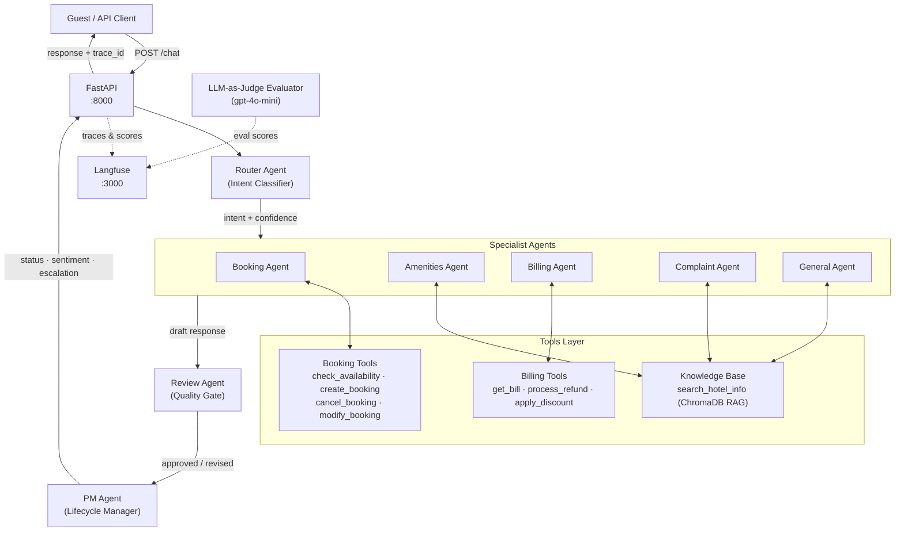
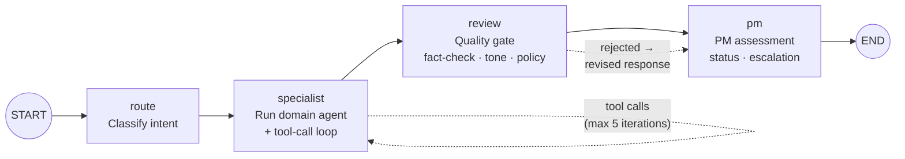
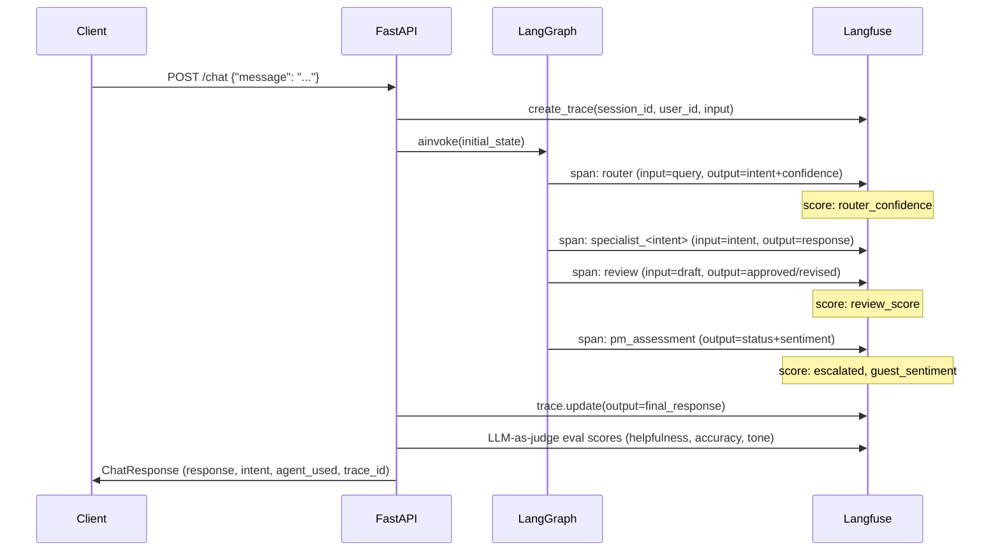
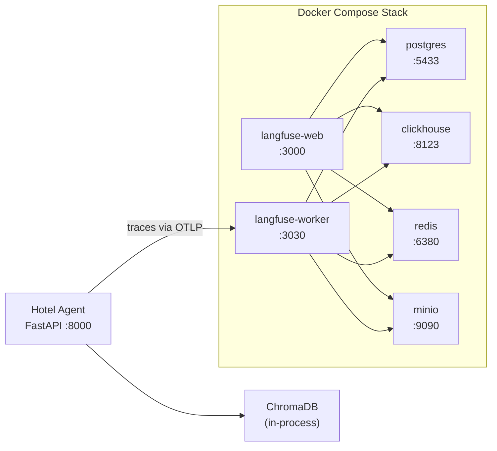

# Hotel Customer Care Agent — with Langfuse Observability

A production-ready **multi-agent AI system** for hotel customer care, built with LangGraph and fully observable via Langfuse. Guest messages are classified by intent, handled by specialist agents, quality-reviewed before delivery, and assessed by a PM agent — every step traced end-to-end.

---

## Architecture Overview



---

## Agent Pipeline (LangGraph Workflow)



### Node Descriptions

| Node | Agent | Responsibility |
|------|-------|---------------|
| `route` | Router | Classifies guest message into one of 5 intents with confidence score |
| `specialist` | Booking / Amenities / Billing / Complaint / General | Handles the query using tools and RAG; runs tool-calling loop up to 5x |
| `review` | Review Agent | Quality gate — checks accuracy, hallucinations, policy compliance, tone; rewrites if needed |
| `pm` | PM Agent | Assesses interaction lifecycle; flags escalation, tracks sentiment and query status |

---

## Observability with Langfuse



### Scores Captured Per Trace

| Score Name | Source | Description |
|---|---|---|
| `router_confidence` | Router Agent | LLM's confidence in intent classification (0–1) |
| `review_score` | Review Agent | Quality score of specialist response (1–10) |
| `escalated` | PM Agent | 1.0 if escalated to human, 0.0 otherwise |
| `guest_sentiment` | PM Agent | 1.0 positive → 0.0 frustrated |
| `eval_helpfulness` | LLM Evaluator | 1–5 helpfulness score |
| `eval_accuracy` | LLM Evaluator | 1–5 factual accuracy score |
| `eval_tone` | LLM Evaluator | 1–5 hospitality tone score |
| `eval_overall` | LLM Evaluator | Average of helpfulness + accuracy + tone |

---

## Infrastructure



---

## Project Structure

```
hotel-agent-langfuse/
├── src/hotel_agent/
│   ├── agents/
│   │   ├── router.py          # Intent classification (5 intents)
│   │   ├── booking.py         # Reservations specialist
│   │   ├── amenities.py       # Facilities & features specialist
│   │   ├── billing.py         # Payments & refunds specialist
│   │   ├── complaints.py      # Complaints & escalation specialist
│   │   ├── general.py         # General FAQ specialist
│   │   ├── review_agent.py    # Quality gate before response delivery
│   │   └── pm_agent.py        # Interaction lifecycle manager
│   ├── graph/
│   │   └── workflow.py        # LangGraph StateGraph definition
│   ├── tools/
│   │   ├── booking_tools.py   # Booking CRUD operations
│   │   ├── billing_tools.py   # Billing & refund operations
│   │   └── knowledge_base.py  # ChromaDB RAG search
│   ├── observability/
│   │   ├── tracing.py         # Langfuse v3 trace/span helpers
│   │   ├── evaluation.py      # LLM-as-judge evaluation pipeline
│   │   └── metrics.py         # Latency & cost tracking
│   ├── knowledge/
│   │   └── vectorstore.py     # ChromaDB vector store setup
│   ├── models/schemas.py      # Pydantic models & LangGraph state
│   ├── config.py              # Settings from .env
│   └── main.py                # FastAPI app & endpoints
├── scripts/
│   ├── run_evaluation.py      # Batch eval: fetch traces → LLM judge → push scores
│   └── seed_knowledge.py      # Seed ChromaDB with hotel knowledge
├── data/hotel_knowledge/      # Hotel FAQs, policies, room info, facilities
├── docker-compose.yml         # Full Langfuse stack (postgres, clickhouse, redis, minio)
├── pyproject.toml
└── .env
```

---

## Setup & Running

### Prerequisites

- Python 3.11+
- Docker & Docker Compose
- OpenAI API key

### 1. Clone and configure

```bash
git clone <repo-url>
cd hotel-agent-langfuse

cp .env.example .env
# Edit .env — set your OPENAI_API_KEY
# Langfuse keys are pre-configured for the local docker setup:
#   LANGFUSE_PUBLIC_KEY=pk-lf-local-hotel
#   LANGFUSE_SECRET_KEY=sk-lf-local-hotel
#   LANGFUSE_HOST=http://localhost:3000
```

### 2. Create virtual environment and install

```bash
python3.11 -m venv .venv
source .venv/bin/activate       # Windows: .venv\Scripts\activate

pip install -e ".[dev]"
```

### 3. Start Langfuse (Docker)

```bash
docker compose up -d

# Wait for Langfuse to be ready (~30s)
curl http://localhost:3000/api/public/health
# Expected: {"status":"OK","version":"..."}
```

Langfuse UI: [http://localhost:3000](http://localhost:3000)
Login: `admin@hotel.local` / `admin123`

### 4. Seed the knowledge base

```bash
python scripts/seed_knowledge.py
```

### 5. Start the hotel agent API

```bash
uvicorn hotel_agent.main:app --host 0.0.0.0 --port 8000 --reload
```

---

## API Usage

### Health check

```bash
curl http://localhost:8000/health
# {"status":"healthy","langfuse_connected":true,"chromadb_ready":true}
```

### Chat with the agent

```bash
curl -X POST http://localhost:8000/chat \
  -H "Content-Type: application/json" \
  -d '{"message": "I want to book a room for 2 nights"}'
```

**Response:**
```json
{
  "response": "I'd be happy to help you with a booking...",
  "intent": "booking",
  "agent_used": "booking_agent",
  "session_id": "82d7a8d6-...",
  "trace_id": "bbe51c87...",
  "query_status": "in_progress",
  "review_score": 5.0
}
```

### Other endpoints

| Method | Endpoint | Description |
|--------|----------|-------------|
| GET | `/health` | System health (Langfuse + ChromaDB) |
| GET | `/metrics` | Agent performance summary |
| GET | `/tools` | All registered tool schemas |
| GET | `/tools/status` | MCP agent tool usage stats |
| GET | `/db/status` | Database agent health |

---

## Running Evaluations

The evaluation script fetches the 10 most recent traces from Langfuse, runs an LLM-as-judge evaluation on each, and pushes scores back to Langfuse.

```bash
python scripts/run_evaluation.py
```

**Example output:**
```
Fetching recent traces from Langfuse...
Found 10 traces. Running evaluation...

============================================================
EVALUATION RESULTS
============================================================

  Trace: e9b8a77a...
    Helpfulness: 5/5
    Accuracy:    5/5
    Tone:        5/5
    Reasoning:   The AI response fully addresses the guest's query...

------------------------------------------------------------
AVERAGES:
  helpfulness: 4.6/5
  accuracy:    4.6/5
  tone:        4.9/5
  OVERALL:     4.7/5

Scores pushed to Langfuse. Check your dashboard!
```

Scores appear in the Langfuse UI under each trace's **Scores** tab.

---

## How It Works — Request Lifecycle

1. **Guest sends a message** → `POST /chat`
2. **Langfuse trace created** with session ID, user ID, and input
3. **Router Agent** classifies the intent (`booking`, `amenities`, `billing`, `complaint`, `general`) with a confidence score → score pushed to Langfuse
4. **Specialist Agent** handles the query — runs a tool-calling loop (up to 5 iterations) using domain-specific tools and ChromaDB RAG
5. **Review Agent** quality-gates the draft response: checks accuracy, hallucinations, policy compliance, and tone. If rejected, it rewrites the response
6. **PM Agent** assesses the full interaction: marks query status (`resolved` / `in_progress` / `escalated`), evaluates guest sentiment, flags if human escalation is needed → scores pushed to Langfuse
7. **Response returned** with intent, agent used, session ID, trace ID, and auto-evaluation score
8. **LLM-as-judge evaluation** runs (helpfulness, accuracy, tone 1–5) → scores pushed to Langfuse

---

## Environment Variables

| Variable | Description | Default |
|---|---|---|
| `OPENAI_API_KEY` | OpenAI API key | required |
| `OPENAI_MODEL` | Model for all agents | `gpt-4o` |
| `LANGFUSE_PUBLIC_KEY` | Langfuse project public key | `pk-lf-local-hotel` |
| `LANGFUSE_SECRET_KEY` | Langfuse project secret key | `sk-lf-local-hotel` |
| `LANGFUSE_HOST` | Langfuse instance URL | `http://localhost:3000` |
| `APP_ENV` | Application environment | `development` |
| `LOG_LEVEL` | Logging level | `INFO` |
